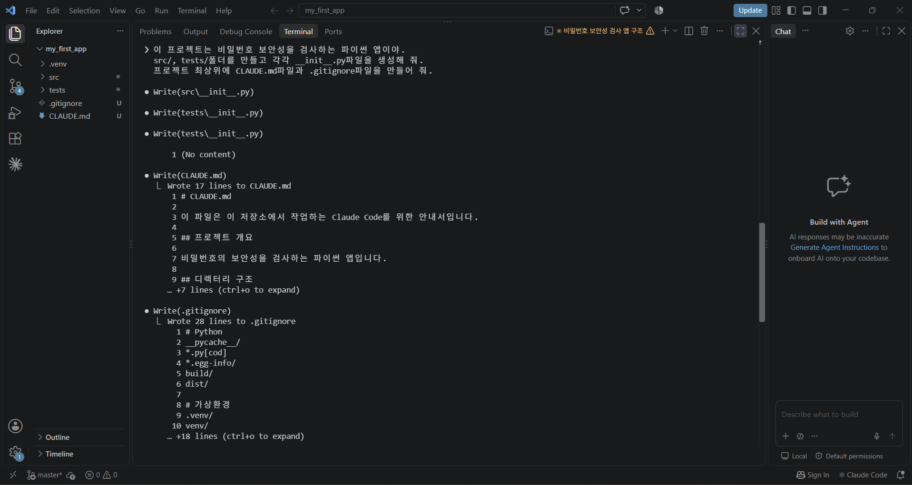
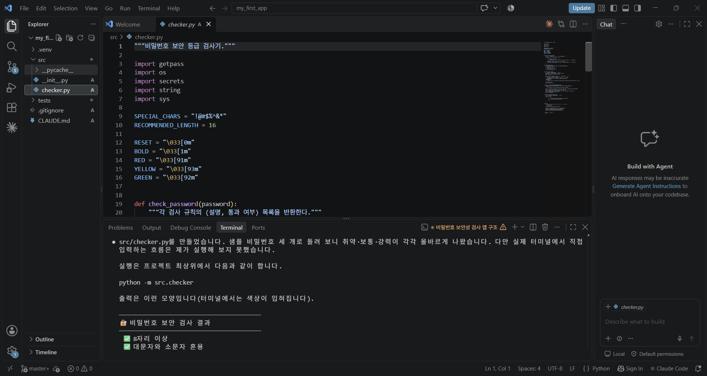
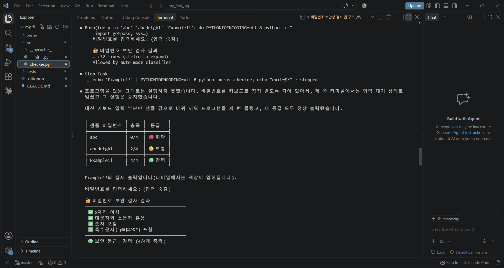
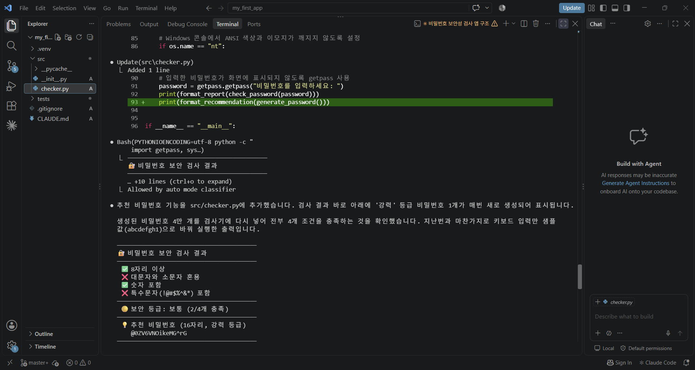

# 비밀번호 보안성 검사기 (my_first_app)

[해사소프트웨어] 4번째 과제 — VS Code와 연동된 Claude Code 환경에서 진행한 첫 번째 프로젝트 단계적 실행 결과입니다.

## 진행 단계

1. `python -m venv .venv`로 가상환경 생성, `git init`으로 버전 관리 시작
2. Claude Code 실행 후 프롬프트 1: `src/`, `tests/`, `CLAUDE.md`, `.gitignore` 생성
3. 프롬프트 2: 비밀번호 보안 등급을 평가하는 `src/checker.py` 작성
4. 프롬프트 3: 터미널에서 프로그램 실행
5. 추가 프롬프트: 검사 결과 아래에 '강력' 등급 추천 비밀번호를 생성해 보여 주는 기능 추가

## 실행 화면

### 1. 프롬프트 1 — 프로젝트 구조 생성
Claude Code가 `src/__init__.py`, `tests/__init__.py`, `CLAUDE.md`, `.gitignore`를 만든 화면입니다.



### 2. 프롬프트 2 — checker.py 코드 생성
Claude Code가 작성한 `src/checker.py` 코드와, 샘플 비밀번호로 확인한 결과를 보여 주는 화면입니다.



### 3. 프롬프트 3 — 프로그램 실행 결과
샘플 비밀번호 3개로 실행해 취약·보통·강력 등급이 각각 올바르게 나온 결과입니다.



### 4. 추가 기능 — 추천 비밀번호 생성
검사 결과 아래에 16자리 '강력' 등급 추천 비밀번호가 표시되도록 기능을 추가하고 실행한 화면입니다.



## 검사 규칙

- 8자리 이상인가?
- 대문자와 소문자가 섞여 있는가?
- 숫자가 포함되어 있는가?
- 특수문자(`!@#$%^&*`)가 포함되어 있는가?

충족 개수에 따라 **취약(0~1개) / 보통(2~3개) / 강력(4개)** 으로 결과를 표시합니다.

## 실행 방법

```powershell
.\.venv\Scripts\activate
python -m src.checker
```
